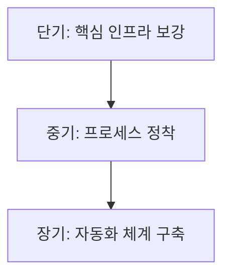

# 내가 정보보안기사 필기를 합격하고 실기를 보려고 해. 위의 출제기준과 다른 사람들이 정리한 것을 바탕으로 내가 알아야 하는 내용에 대해 정리해줄 수 있어

정보보안기사 실기 시험을 준비하기 위해 필요한 주요 내용을 정리했습니다. 실기 시험은 필기와 달리 실무 능력과 서술형 답변 능력을 평가하므로 체계적인 학습이 중요합니다.

---

## **1. 실기 시험 구성**

- **시험 방식**: 필답형(주관식)
- **문제 유형 및 배점**:
    - 단답형: 12문제, 총 36점
    - 서술형: 4문제, 총 48점
    - 실무형: 2문제 중 1문제 선택, 총 16점
- **합격 기준**: 100점 만점에 60점 이상[^1_8][^1_9].

---

## **2. 출제 주요 항목**

실기 시험은 실무와 이론을 통합적으로 평가합니다. 주요 항목은 다음과 같습니다:

### **1) 시스템 및 네트워크 보안**

- **운영체제별 보안 특성**:
    - Windows, Linux, Unix 등 운영체제의 보안 설정 및 로그 관리.
- **프로토콜별 보안 특성**:
    - TCP/IP, SSL/TLS, IPSec 등 프로토콜의 동작 원리와 취약점.
- **서비스별 보안 특성**:
    - FTP, 메일, 웹, DNS, DB 서비스의 보안 설정과 공격 대응.
- **보안 장비 및 네트워크 장비**:
    - 방화벽(Firewall), IDS/IPS 등의 설정 점검 및 보완[^1_1][^1_2].


### **2) 취약점 점검 및 관리**

- 운영체제, 네트워크 장비, 보안 장비의 취약점 점검 방법.
- 발견된 취약점 기록 및 보완 사항 관리[^1_1][^1_2].


### **3) 로그 분석 및 대응**

- 시스템 및 네트워크 장비에서 생성되는 로그 정보를 분석하여 침입 원인 파악.
- 통합 보안 로그를 통해 비정상 접근과 변경 사항 확인[^1_1][^1_2].


### **4) 최신 보안 사고 대응**

- APT 공격, DoS/DDoS 등 최신 위협 사례 분석 및 대응 방안.
- 디지털 포렌식 기법 활용[^1_1][^1_2].

---

## **3. 추천 학습 방법**

### **1) 기본 이론 학습**

- 기본서를 정독하며 핵심 개념을 정리합니다.
- 운영체제 보안 설정, 네트워크 프로토콜 동작 원리 등 필수 이론을 숙지합니다[^1_4][^1_5].


### **2) 기출문제 풀이**

- 최근 3~5년간의 기출문제를 반복적으로 풀어 문제 유형을 익힙니다.
- 틀린 문제는 다시 복습하며 개념을 확실히 이해합니다[^1_5][^1_7].


### **3) 실습 환경 구축**

- 가상 머신(VM)을 활용해 Linux 명령어 연습 및 방화벽 설정 실습.
- Wireshark 등 패킷 분석 도구 사용 연습.
- OWASP를 통해 웹 보안 취약점 분석 실습[^1_5][^1_7].


### **4) 서술형 답변 연습**

- 키워드를 중심으로 간결하고 논리적인 답안을 작성하는 연습이 필요합니다.
- 채점 기준에 맞춰 답안을 작성하고 스스로 피드백을 합니다[^1_9].

---

## **4. 추가 팁**

- 최신 보안 동향과 관련 법규를 지속적으로 학습하세요. 정보보호 관리체계(ISMS-P) 인증이나 개인정보보호법 등도 중요합니다[^1_6].
- 엑셀이나 노트를 활용해 공부 내용을 체계적으로 정리하세요. 이는 복습과 검색에 유용합니다[^1_4].
- 시간 관리가 중요하므로 시험일까지의 학습 계획을 세우고 꾸준히 실천하세요.

---

정보보안기사 실기는 난이도가 높지만 체계적인 준비와 반복 학습으로 충분히 합격할 수 있습니다.

<div style="text-align: center">⁂</div>

[^1_1]: jeongboboangisa-culjegijun.pdf

[^1_2]:   - 1 -

[^1_3]: https://www.cq.or.kr/qh_quagm01_020.do

[^1_4]: https://remybaek.tistory.com/153

[^1_5]: https://andyinfor.com/entry/2025-정보보안기사-합격-전략-공부법-기출문제-실기

[^1_6]: https://blog.naver.com/funnycry/223740419499

[^1_7]: https://blog.naver.com/pso164/223325192478

[^1_8]: https://rubywind.tistory.com/101

[^1_9]: https://blog.naver.com/stereok2/223225997316

[^1_10]: https://studysteadily.tistory.com/73

[^1_11]: https://blog.naver.com/minorria/223740363442

[^1_12]: https://blog.naver.com/stereok2/223043728846

[^1_13]: https://velog.io/@redford07/정보보안기사-24회-실기-후기

[^1_14]: https://www.cq.or.kr/qh_cusgm01_003.do?inqireCn=\&menuFg=\&pageIndex=1\&menuPg=\&menuTp=m_100000001235\&menuId=m_100000001236\&inqireSe=1\&menuTm=m_100000001235\&bbscttNo=611

[^1_15]: https://velog.io/@0216tw/정보보안기사-합격후기

[^1_16]: https://toubva.github.io/blog/certification_study/cert_pass

[^1_17]: https://www.cq.or.kr/qh_cusgm10_001.do

[^1_18]: https://rubywind.tistory.com/47

[^1_19]: https://www.youtube.com/watch?v=o4uJ9lSYBzc

[^1_20]: https://it-freelancer.tistory.com/1369

[^1_21]: http://educh.co.kr/board/view/1988?bi=infonews

[^1_22]: https://choimungu.tistory.com/332


---

# 1번에 시스템 및 네트워크 보안 특성 파악에서 알아야하는 내용에 대해 자세히 적어줘

정보보안기사 실기 시험에서 **시스템 및 네트워크 보안 특성**을 파악하기 위해 알아야 할 내용을 자세히 정리했습니다. 이는 운영체제, 네트워크 프로토콜, 서비스, 그리고 보안 장비의 특성과 관련된 주요 개념을 포함합니다.

---

## **1. 운영체제 보안**

운영체제는 시스템 보안의 기본 제공자로서 다양한 보안 기능과 설계 원리를 포함합니다.

### **운영체제 보안 기능**

- **메모리 보호**: 메모리 접근을 제한하여 악의적인 접근 방지.
- **파일 보호**: 파일 읽기/쓰기 권한 설정 및 접근 제어.
- **접근 통제**: 사용자와 프로세스의 자원 접근을 제한.
- **사용자 인증**: ID와 비밀번호 또는 기타 인증 수단을 통한 사용자 확인.


### **보안 설계 원리**

- **최소 권한 원칙**: 사용자와 프로그램은 필요한 최소한의 권한만 사용.
- **권한 분리**: 하나의 보호 시스템이 파괴되더라도 전체 시스템이 손상되지 않도록 설계.
- **허용에 의한 접근**: 기본적으로 모든 접근은 거부하며, 허용된 경우에만 접근 가능.
- **계층적 보안성**: 다단계 보안 체계를 통해 위협을 최소화.


### **보안 운영체제 기능**

- 강제적 접근 통제(MAC) 및 임의적 접근 통제(DAC).
- 침입 탐지 및 감사 기록 관리.
- 안전한 경로 제공(예: 암호화된 통신 채널)[^2_1][^2_5].

---

## **2. 네트워크 프로토콜 보안**

네트워크 프로토콜은 데이터 전송 과정에서 발생할 수 있는 취약점을 보완하기 위한 다양한 보안 기술을 포함합니다.

### **주요 프로토콜 및 보안 특성**

- **TLS/SSL**: TCP 위에서 동작하며 데이터 암호화와 상호 인증 제공.
- **IPSec**: IP 계층에서 암호화와 인증을 통해 안전한 통신 채널 제공. 전송 모드(End-to-End)와 터널 모드(라우터 간)로 구분됨.
- **FTP/SFTP**:
    - FTP는 평문으로 데이터를 전송하므로 SSL 또는 SSH를 활용하여 암호화가 필요.
    - SFTP는 SSH 기반으로 안전한 파일 전송 지원[^2_2][^2_3][^2_6].

---

## **3. 서비스별 보안 특성**

주요 IT 서비스는 각각 고유의 동작 절차와 취약점을 가지며 이에 따른 보안 대책이 필요합니다.

### **주요 서비스와 취약점**

- **FTP**:
    - 평문 비밀번호 전송 및 익명 사용자 접근 취약점 존재.
    - SSL/TLS 또는 SFTP 사용으로 해결 가능.
- **메일 서비스(SMTP)**:
    - 스팸 메일과 피싱 공격에 취약.
    - DKIM, SPF, DMARC 등의 인증 기술 활용.
- **웹 서비스(HTTP/HTTPS)**:
    - SQL Injection, XSS 등 웹 취약점 존재.
    - 웹 애플리케이션 방화벽(WAF) 사용으로 대응.
- **DNS**:
    - DNS Spoofing, Cache Poisoning 공격에 취약.
    - DNSSEC로 무결성 검증 가능[^2_3][^2_7].

---

## **4. 네트워크 장비 및 보안 장비**

네트워크 내외부에서 발생하는 위협에 대응하기 위해 다양한 장비를 활용합니다.

### **보안 장비의 역할**

- **방화벽(Firewall)**:
    - 미리 정의된 규칙에 따라 트래픽 필터링 및 차단 수행.
    - 내부 네트워크와 외부 네트워크 간 트래픽 제어.
- **침입 탐지 시스템(IDS)**:
    - 네트워크 트래픽을 모니터링하고 이상 행위를 탐지하여 관리자에게 경고.
    - 수동적 방식으로 탐지 후 조치를 요구함.
- **침입 방지 시스템(IPS)**:
    - IDS와 유사하지만, 실시간으로 악성 트래픽을 차단하는 능동적 방어 시스템[^2_4][^2_8].

---

## 요약

시스템 및 네트워크 보안을 이해하려면 운영체제의 기본 보안 원리, 네트워크 프로토콜의 동작과 취약점, 주요 서비스별 위협 요소와 대응책, 그리고 방화벽/IDS/IPS 같은 장비들의 역할을 숙지해야 합니다. 이를 바탕으로 실무적인 문제 해결 능력을 키우는 것이 중요합니다.

<div style="text-align: center">⁂</div>

[^2_1]: https://ttend.tistory.com/146

[^2_2]: https://blog.naver.com/mk_crew/221938275485

[^2_3]: https://choimungu.tistory.com/140

[^2_4]: https://maker5587.tistory.com/8

[^2_5]: https://eliotjang.github.io/컴퓨터공학/network-security-ch03/

[^2_6]: https://noredstone.tistory.com/206

[^2_7]: https://nakyungpapa.tistory.com/68

[^2_8]: https://brunch.co.kr/@@JqQ/49

[^2_9]: https://blog.naver.com/stereok2/221462012556

[^2_10]: https://somaz.tistory.com/344

[^2_11]: https://duni-world.tistory.com/13

[^2_12]: https://seleuchel.tistory.com/215

[^2_13]: https://bit1919.tistory.com/101

[^2_14]: https://0boss.tistory.com/85

[^2_15]: https://bitconsulting.tistory.com/entry/정보보안기사-출제기준실기

[^2_16]: https://catchingitsecure.tistory.com/4

[^2_17]: https://velog.io/@show7441/전공-네트워크-보안-기술

[^2_18]: https://teacheryoon.tistory.com/5

[^2_19]: https://blog.naver.com/stereok2/221404301940

[^2_20]: https://taesam.tistory.com/32


---

# 2. 취약점 점검 및 보완에서 알아야하는 내용에 대해 자세히 적어줘

정보보안기사 실기 시험에서 **취약점 점검 및 보완**은 조직의 보안 상태를 지속적으로 개선하기 위한 체계적인 프로세스입니다. 이는 취약점 식별부터 위험 평가, 보완 조치까지의 전 단계를 포함합니다.

---

## **1. 취약점 관리 라이프사이클**

취약점 관리는 지속적인 순환 과정으로, 다음 6단계로 구성됩니다[^3_1][^3_3][^3_6].


| 단계 | 주요 활동 |
| :-- | :-- |
| **자산 식별** | 네트워크 내 모든 자산(하드웨어, 소프트웨어, 서비스) 목록화 및 중요도 분류[^3_3][^3_6] |
| **취약점 평가** | 자동화 도구(예: Nessus, OpenVAS)를 활용한 시스템 스캐닝 및 수동 검증[^3_4][^3_7] |
| **우선순위 결정** | CVSS 점수, 자산 중요도, 공격 가능성 등을 고려해 위험도 순위 지정[^3_2][^3_8] |
| **보완 계획 수립** | 패치 적용, 설정 변경, 대체 솔루션 도입 등 구체적 조치 방안 마련[^3_5][^3_10] |
| **조치 실행** | 긴급 취약점은 즉시 수정, 저위험 항목은 일정 계획에 따라 처리[^3_5][^3_6] |
| **검증 및 모니터링** | 조치 효과 확인 후 재스캔 수행, 지속적 모니터링으로 새로운 취약점 탐지[^3_3][^3_7] |


---

## **2. 주요 단계별 상세 방법**

### **1) 취약점 식별**

- **자동화 스캐닝**: Nessus, QualysGuard 등 도구로 네트워크/시스템 전반 검사[^3_4][^3_7]
- **수동 점검**: OWASP ZAP, Nmap 스크립트를 활용한 심층 분석[^3_9]
- **로그 분석**: 시스템 로그에서 비정상 접근 시도 탐지[^3_8]


### **2) 위험 평가**

- **CVSS(Common Vulnerability Scoring System) 기준**:
    - 취약점의 **악용 용이성**, **영향 범위**, **환경적 요소**를 종합 평가[^3_2][^3_8]
    - 예: 원격 코드 실행 취약점(CVSS 9.8) > 로컬 권한 상승 취약점(CVSS 6.2)


### **3) 보완 전략**

|  | 전략 | 적용 사례 |
| :-- | :-- | :-- |
| **완전 제거** | 취약 컴포넌트 교체 | Log4j 취약점 발생 시 최신 버전으로 업그레이드[^3_5] |
| **부분 완화** | 방화벽 규칙 추가 | 패치 불가 시 특정 IP 대역 차단[^3_5][^3_10] |
| **수용** | 위험 수준이 낮을 경우 | 저위험 취약점에 한해 조치 유예[^3_5] |


---

## **3. 핵심 보완 기법**

### **1) 패치 관리**

- **자동 업데이트 시스템** 구축(예: WSUS, SCCM)
- **Zero-Day 대응**: 가상 패치(Virtual Patching) 기술 활용[^3_10]


### **2) 설정 강화**

- 불필요한 서비스 비활성화
- 최소 권한 원칙 적용(Least Privilege)[^3_2][^3_6]


### **3) 아키텍처 개선**

- 마이크로세그멘테이션 도입으로 공격 표면 축소
- 컨테이너 환경 보안 강화(Docker Bench for Security 활용)[^3_9]

---

## **4. 활용 도구**

| 도구 유형 | 대표 솔루션 | 특징 |
| :-- | :-- | :-- |
| **네트워크 스캐너** | Nessus, OpenVAS | 다층 프로토콜 지원, 실시간 취약점 DB 업데이트[^3_4][^3_9] |
| **웹 취약점 분석** | Acunetix, OWASP ZAP | SQLi/XSS 등 OWASP Top 10 취약점 집중 검사[^3_4][^3_9] |
| **클라우드 통합** | Wiz, Rapid7 InsightVM | 멀티클라우드 환경 통합 모니터링[^3_6] |
| **자동화 플랫폼** | Balbix, Microsoft Defender | AI 기반 위협 예측 및 우선순위 제안[^3_1][^3_6] |


---

## **5. 모범 사례**

- **정기적 평가**: 분기별 전사적 스캔 + 주요 시스템은 월간 점검[^3_2][^3_7]
- **팀 간 협업**: 보안팀-운영팀-개발팀의 공동 대응 체계 구축[^3_6][^3_10]
- **컴플라이언스 연계**: PCI DSS, ISO 27001 요구사항 반영[^3_2][^3_8]
- **취약점 DB 관리**: CVE, NVD 정보를 실시간으로 반영한 스캔 정책 수립[^3_4][^3_8]

이 과정에서 가장 중요한 것은 **위험 기반 접근법(Risk-Based Approach)**입니다. 모든 자원을 최상위 위협에 집중 투입해야 효율적인 보안 운영이 가능합니다[^3_1][^3_3][^3_6].

<div style="text-align: center">⁂</div>

[^3_1]: https://www.microsoft.com/en-us/security/business/security-101/what-is-vulnerability-management

[^3_2]: https://www.sisainfosec.com/blogs/what-is-vulnerability-assessment-why-is-it-important-in-2024/

[^3_3]: https://www.bluevoyant.com/knowledge-center/vulnerability-management-complete-guide-to-process-and-tools

[^3_4]: https://www.balbix.com/insights/what-to-know-about-vulnerability-scanning-and-tools/

[^3_5]: https://www.blackduck.com/blog/vulnerability-remediation-4-options.html

[^3_6]: https://www.wiz.io/academy/vulnerability-management-best-practices

[^3_7]: https://www.balbix.com/insights/vulnerability-assessments-drive-enhanced-security-and-cyber-resilience/

[^3_8]: https://www.hackerone.com/knowledge-center/what-vulnerability-assessment-benefits-tools-and-process

[^3_9]: https://owasp.org/www-community/Vulnerability_Scanning_Tools

[^3_10]: https://www.jamf.com/blog/vulnerability-remediation-why-your-security-relies-on-it/

[^3_11]: https://www.balbix.com/insights/what-is-vulnerability-management/

[^3_12]: https://vulcan.io/basics/the-ultimate-guide-to-vulnerability-management/

[^3_13]: https://www.linkedin.com/pulse/importance-vulnerability-assessment-types-methodologies-indusface

[^3_14]: https://www.rapid7.com/fundamentals/vulnerability-management-and-scanning/

[^3_15]: https://www.imperva.com/learn/application-security/vulnerability-assessment/

[^3_16]: https://brightsec.com/blog/the-critical-importance-of-vulnerability-assessments/

[^3_17]: https://www.ibm.com/blog/what-is-the-vulnerability-management-process/

[^3_18]: https://www.crowdstrike.com/en-us/cybersecurity-101/exposure-management/vulnerability-management/

[^3_19]: https://www.extnoc.com/learn/security/vulnerability-assessment-important

[^3_20]: https://www.ncsc.gov.uk/collection/vulnerability-management/guidance

[^3_21]: https://cybeready.com/category/the-infosec-essential-guide-to-vulnerability-management

[^3_22]: https://purplesec.us/learn/vulnerability-management-benefits/

[^3_23]: https://www.gartner.com/reviews/market/vulnerability-assessment

[^3_24]: https://www.sentinelone.com/cybersecurity-101/cybersecurity/vulnerability-remediation-tracking-best-practices-tools/

[^3_25]: https://pentest-tools.com/website-vulnerability-scanning/website-scanner

[^3_26]: https://pathlock.com/learn/vulnerability-remediation/

[^3_27]: https://purplesec.us/learn/vulnerability-management/

[^3_28]: https://hostedscan.com

[^3_29]: https://www.ontinue.com/vulnerability-mitigation/

[^3_30]: https://www.redlegg.com/blog/6-steps-of-vulnerability-scanning-best-practices

[^3_31]: https://www.cisa.gov/resources-tools/resources/free-cybersecurity-services-and-tools

[^3_32]: https://www.centraleyes.com/top-5-strategies-for-vulnerability-mitigation/

[^3_33]: https://www.fordham.edu/information-technology/it-security--assurance/it-policies-procedures-and-guidelines/vulnerability-management-procedure/

[^3_34]: https://www.ibm.com/think/topics/vulnerability-management

[^3_35]: https://www.techtarget.com/searchsecurity/definition/vulnerability-assessment-vulnerability-analysis

[^3_36]: https://www.legitsecurity.com/blog/-top-vulnerability-management-tools-tips-and-best-practices

[^3_37]: https://www.coresecurity.com/blog/top-14-vulnerability-scanners-cybersecurity-professionals

[^3_38]: https://purplesec.us/learn/vulnerability-remediation/


---

# 3번 보안관제 및 대응 파트에서 알아야하는 내용에 대해 자세히 적어줘

정보보안기사 실기 시험에서 **보안관제 및 대응** 파트는 실시간 위협 탐지부터 사후 대응까지 전 과정을 체계적으로 다루는 핵심 영역입니다. 조직의 보안 목표에 따라 로그 분석, 침해 사고 대응, 디지털 포렌식 등을 수행하는 능력을 평가합니다.

---

## **1. 보안관제 기본 개념**

### **1) 정의**

- 조직의 정보 시스템(서버, 네트워크 장비, 보안 장비)에서 발생하는 **로그 이벤트를 24x365 모니터링**하여 APT 공격, DDoS 등의 위협을 탐지·차단하는 활동[^4_3][^4_6].


### **2) 핵심 원칙**

- **사전 예방**: IDS/IPS를 통한 실시간 패턴 분석
- **신속한 대응**: SOAR(Security Orchestration, Automation and Response)을 활용한 자동화 조치[^4_6]
- **법적 근거 준수**: 정보통신망법, 개인정보보호법 등 관련 법규 반영[^4_3]

---

## **2. 주요 업무 내용**

### **1) 모니터링**

- **대상**: 방화벽, 웹방화벽, Anti-DDoS 솔루션, 통합 보안로그[^4_4]
- **방법**:
    - 네트워크 트래픽 패턴 분석(Wireshark 활용)
    - 시스템 로그에서 비정상 로그인 시도 탐지
    - 보안장비 알림 메시지 집중 감시[^4_7]


### **2) 침해 탐지**

- **탐지 유형**:
    - **알려진 공격**: 시그니처 기반 탐지(예: OWASP Top 10)
    - **알 수 없는 공격**: AI 기반 행위 분석(비정상 트래픽 군집화)[^4_6]
- **탐지 도구**:

```bash
# Suricata를 이용한 네트워크 트래픽 분석 예시
suricata -c /etc/suricata/suricata.yaml -i eth0
```


### **3) 대응 절차**

1. **초동 조치**: 차단 목록 업데이트, 세션 차단[^4_4]
2. **영향도 분석**: 침투 경로 추적(트래픽 패킷 덤프 분석)
3. **복구 계획**: 백업 데이터 검증 후 복원
4. **보고서 작성**: 타임라인 기반 침해사고 보고서 작성[^4_3]

---

## **3. 기술적 구성 요소**

### **1) 솔루션 계층**

| 계층 | 솔루션 | 역할 |
| :-- | :-- | :-- |
| **네트워크** | Snort, Zeek | 실시간 패킷 분석 |
| **호스트** | OSSEC, Wazuh | 파일 무결성 검사 |
| **클라우드** | AWS GuardDuty | 이상 API 호출 감지 |

### **2) 분석 기술**

- **로그 상관 관계 분석**: 서로 다른 시스템 로그를 연계해 공격 경로 재구성
- **디지털 포렌식**: FTK Imager로 메모리 덤프 분석, 타임스탬프 기반 증거 수집[^4_3]
- **위협 인텔리전스**: MISP 플랫폼을 통한 IoC(Indicator of Compromise) 공유[^4_6]

---

## **4. 현장 적용 사례**

### **APT 공격 대응**

1. **탐지**: 외부 C2 서버와의 비정상 통신 로그 발견[^4_7]
2. **격리**: 감염 시스템 네트워크 세그멘테이션
3. **근절**: 메모리 악성코드 제거(Volatility 활용)
4. **방어체계 강화**: EDR 솔루션 배포[^4_6]

### **랜섬웨어 사고 처리**

- **초기 대응**: 암호화된 파일 확장자 패턴 검출
- **복구**: 섀도 복사본 확인 후 백업 서버에서 복원
- **예방**: 사용자 권한 최소화 정책 적용[^4_4]

---

## **5. 최신 동향**

- **AI 기반 관제**:
    - **군집화 알고리즘**: 40억 건/일 이상의 이벤트 처리(SK쉴더스 사례)[^4_6]
    - **자동 보고서 생성**: ChatGPT API 연동을 통한 실시간 보고[^4_6]
- **통합 모니터링**: 멀티클라우드 환경에서의 통합 로그 관리(Wiz 플랫폼)

---

보안관제 역량 강화를 위해 **실제 침해사고 시나리오 기반 모의훈련**을 추천합니다. 특히 SIEM(Security Information and Event Management) 도구의 Rule 설정 실습이 필수적입니다.

<div style="text-align: center">⁂</div>

[^4_1]: http://www.studynote.co.kr/widget/img/file/examinfo01.pdf

[^4_2]: https://worldtour1.tistory.com/153

[^4_3]: http://www.boannews.com/media/news_print.asp?idx=50451

[^4_4]: https://m.boannews.com/html/detail.html?idx=37409\&kind=3\&search=title\&find=���Ȱ�����

[^4_5]: https://instamarketing.tistory.com/185

[^4_6]: https://www.skshieldus.com/blog-security/security-trend-idx-29

[^4_7]: https://teacheryoon.tistory.com/31

[^4_8]: https://www.ahnlab.com/ko/product/managed-security-service

[^4_9]: https://blog.naver.com/GoPost.naver?blogId=stereok2\&logNo=223481498564

[^4_10]: https://blog.naver.com/stereok2/221458600951

[^4_11]: https://www.hisc.or.kr/page/subPage.do?page=sub4_1\&muNo=6\&muGpNo=5\&muPrNo=5

[^4_12]: https://noredstone.tistory.com/91

[^4_13]: https://jjingsung.tistory.com/20

[^4_14]: https://www.igloo.co.kr/security-information/차세대-보안관제체계-완성을-위한-핵심-키워드-정보/

[^4_15]: https://product.kyobobook.co.kr/detail/S000214301680

[^4_16]: https://cordinghouse.tistory.com/308

[^4_17]: https://www.kisia.or.kr/bucket/uploads/2025/01/14/[정보보호 isc] 2024년도 4분기 이슈리포트_%EB%B3%B4%EC%95%88%EA%B4%80%EC%A0%9C%20%EC%97%85%EA%B3%84%ED%98%84%ED%99%A9%20%EB%B0%8F%20%EC%9D%B8%EB%A0%A5%EC%96%91%EC%84%B1%20%EB%B0%A9%ED%96%A5(%EA%B3%B5%EA%B3%B5%EA%B8%B0%EA%B4%80%20%EB%B3%B4%EC%95%88%EA%B4%80%EC%A0%9C%20%EC%A4%91%EC%8B%AC%EC%9C%BC%EB%A1%9C).pdf

[^4_18]: https://www.yes24.com/product/goods/142210154

[^4_19]: https://www.kps.co.kr/js/common/content.do;jsessionid=E4915E02F6262B9C168961E95BA37091?selectedId=854\&boardType=5

[^4_20]: https://blog.naver.com/qaq9441/223197874070


---

# 4. 위험분석 및 정보보호 대책 수립 파트도 마찬가지로 알려줘

정보보안기사 실기 시험의 **위험분석 및 정보보호 대책 수립** 파트는 조직의 보안 위협을 체계적으로 평가하고 적절한 대응 전략을 수립하는 과정을 다룹니다. 이는 자산 식별부터 위험 처리 전략까지 종합적인 프로세스 이해가 필요합니다.

---

## **1. 위험분석 프로세스**

### **1) 5단계 절차**

| 단계 | 주요 활동 | 세부 내용 |
| :-- | :-- | :-- |
| **자산 식별** | 정보자산 목록화 | 서버, 네트워크 장비, 데이터베이스 등 분류 및 중요도 평가[^5_1][^5_3] |
| **위협 분석** | 내·외부 위협 도출 | APT, DDoS, 내부자 위협 등 발생 가능성 평가[^5_1][^5_6] |
| **취약성 평가** | 기술·관리적 취약점 진단 | OpenVAS, Nessus로 시스템 스캐닝 + Gap 분석[^5_2][^5_5] |
| **위험도 산정** | 정량/정성적 평가 | CVSS 점수 활용 또는 High/Medium/Low 등급 부여[^5_3][^5_7] |
| **보고서 작성** | CISO 승인 | 분석 결과를 기반으로 위험 처리 전략 제시[^5_2][^5_9] |

### **2) 분석 방법론 비교**

| 방법론 | 특징 | 장점 | 단점 | 적용 사례 |
| :-- | :-- | :-- | :-- | :-- |
| **베이스라인** | ISO 27002 등 표준 기반 | 비용 절감, 빠른 적용 | 조직 특성 반영 부족 | 소규모 기업[^5_3][^5_7] |
| **상세 분석** | 자산-위협-취약성 연계 | 맞춤형 대책 수립 | 전문 인력/시간 소요 | 금융, 의료 기관[^5_5][^5_10] |
| **복합 접근** | 하이브리드 방식 | 유연한 위험 대응 | 고위험 영역 판단 오류 가능 | 중견 기업[^5_7][^5_10] |


---

## **2. 정량적 vs 정성적 분석**

| 구분 | 정량적 분석 | 정성적 분석 |
| :-- | :-- | :-- |
| **기준** | 금전적 손실액 수치화 | 위험 등급(High/Medium/Low) |
| **도구** | 몬테카를로 시뮬레이션 | Delphi 기법 |
| **적용** | 보험료 계산, ROI 분석 | 초기 위험 평가 단계[^5_3][^5_7] |
| **예시** | `연간 예상 손실액 = SLE × ARO` | 매트릭스 기반 위험 매핑 |


---

## **3. 정보보호 대책 수립 전략**

### **1) 4대 위험 처리 전략**

| 전략 | 내용 | 사례 |
| :-- | :-- | :-- |
| **위험 감소** | 패치 적용/설정 변경 | Log4j 취약점 시 즉시 업데이트[^5_9] |
| **위험 수용** | DoA(허용 위험도) 내 보류 | 저위험 시스템의 미패치[^5_9][^5_10] |
| **위험 회피** | 위험 요소 제거 | 클라우드 서비스 중단[^5_8] |
| **위험 전가** | 보험 가입/아웃소싱 | 사이버 보험 청구[^5_10] |

### **2) 대책 선정 기준**

- **TTA(기술적 타당성)**: 솔루션 도입 가능성
- **CBA(비용편익 분석)**: 예상 손실액 대비 투자 효율
- **법적 요구사항**: PCI DSS, 개인정보보호법 준수[^5_2][^5_9]

---

## **4. 대책 이행 계획**

### **1) 3단계 구현 로드맵**




### **2) 필수 문서**

- **위험 처리 명세서**: 미적용 대책과 사유 기록[^5_6][^5_9]
- **구현 계획서**: 예산/일정/담당자 명시[^5_9][^5_10]
- **모니터링 체크리스트**: 분기별 재평가 항목[^5_2][^5_5]

---

## **5. 시험 대비 핵심 포인트**

1. **CVSS 점수 계산**: 공격 경로/복잡도/영향도 평가[^5_3][^5_7]
2. **Gap 분석**: ISMS 인증 기준 대비 현황 차이 도출[^5_2][^5_5]
3. **시나리오 기반 대응**: 랜섬웨어 감염 시 복구 절차 수립[^5_8][^5_10]
4. **법규 연계**: 개인정보보호법 제30조(기술적 조치) 적용[^5_9]

위험분석은 **자산가치-위협-취약성의 삼각관계**를 정확히 이해하는 것이 가장 중요합니다. 기출문제에서 자주 다루는 사례 중심으로 접근하면 효과적입니다[^5_1][^5_6][^5_10].

<div style="text-align: center">⁂</div>

[^5_1]: https://jeongchul.tistory.com/435

[^5_2]: https://blog.naver.com/innerbus_co/220605349679

[^5_3]: https://itwiki.kr/w/위험분석

[^5_4]: https://blog.naver.com/innerbus_co/220609362637

[^5_5]: https://jyols.tistory.com/125

[^5_6]: https://kimsoy-security.tistory.com/62

[^5_7]: https://webstone.tistory.com/138

[^5_8]: https://jeongchul.tistory.com/443

[^5_9]: https://1stepby1step.tistory.com/75

[^5_10]: https://www.kisa.or.kr/204/form?postSeq=010304\&lang_type=KO\&page=

[^5_11]: https://www.kisa.or.kr/204/form?postSeq=001392\&lang_type=KO

[^5_12]: https://blog.naver.com/wnrjsxo/221393899247

[^5_13]: https://peemangit.tistory.com/360

[^5_14]: http://www.koreascience.kr/article/JAKO200411923075199.pdf

[^5_15]: https://www.cela.kr/ISMS_1_2

[^5_16]: https://security-jeong.tistory.com/198

[^5_17]: https://remybaek.tistory.com/150

[^5_18]: http://ael.cbnu.ac.kr/ael/정보보호개론/강의슬라이드/제5과목-정보보안관리 및 법규-제1장-정보보호 관리.pptx

[^5_19]: https://scienceon.kisti.re.kr/srch/selectPORSrchReport.do?cn=TRKO201100004970

[^5_20]: https://snnchallenge.tistory.com/443

[^5_21]: https://33cram.tistory.com/entry/11장-프로젝트-위험-관리-도구-및-기법

[^5_22]: http://public.thinkonweb.com/journals/kiisc/digital-library/manuscript/file/3522/KIISC-1996-6-1-021.pdf

[^5_23]: https://scienceon.kisti.re.kr/srch/selectPORSrchArticle.do?cn=JAKO200211921877556\&dbt=NART

[^5_24]: https://www.jics.or.kr/digital-library/manuscript/file/362/JICS-2006-7-1-003.pdf

[^5_25]: https://swingswing.tistory.com/158

[^5_26]: https://scienceon.kisti.re.kr/srch/selectPORSrchArticle.do?cn=NPAP08116395\&dbt=NPAP

[^5_27]: https://moasoftware.co.kr/ansys/도구를-이용한-사이버-물리-시스템의-사이버-보안-위/

[^5_28]: https://www.kisa.or.kr/204/form?postSeq=010304\&lang_type=KO

[^5_29]: https://koreascience.kr/article/CFKO200536035726528.pdf

[^5_30]: https://ktccs.kips.or.kr/digital-library/manuscript/file/13875/C-2006-13-7-851.pdf

[^5_31]: https://www.inno-n.com/api/file_download?url=upload%2Fsustain\&ori=%EC%A0%95%EB%B3%B4%EB%B3%B4%ED%98%B8%EC%A0%95%EC%B1%85.pdf\&save=20230704134350.pdf

[^5_32]: https://yumc.ac.kr:8443/bbs/FileDown.do?bbsId=news4\&wr_id=4733\&num=2

[^5_33]: https://esg.skdnd.com/api/file-service/?id=information-security-policy\&lang=en

[^5_34]: https://blog.naver.com/6yujin6/221456001296

[^5_35]: https://kto.visitkorea.or.kr/upload/flexer/upload/bd/ktobiz/20160408/902459f7-fd5f-11e5-9917-2d1f0d10f13e.hwp.files/Sections1.html

[^5_36]: https://011cpo.tistory.com/17

[^5_37]: https://blog.naver.com/6yujin6/221455777972

[^5_38]: https://bsj54.tistory.com/47

[^5_39]: https://it-utopia.tistory.com/entry/정보보안기사-실기대비-요약-14정보보호-일반

[^5_40]: https://www.softflow.io/products/software-risk-analysis/software-risk-manager/

[^5_41]: https://taikun30.tistory.com/140

[^5_42]: https://www.isac.or.kr/sub/01/designation

