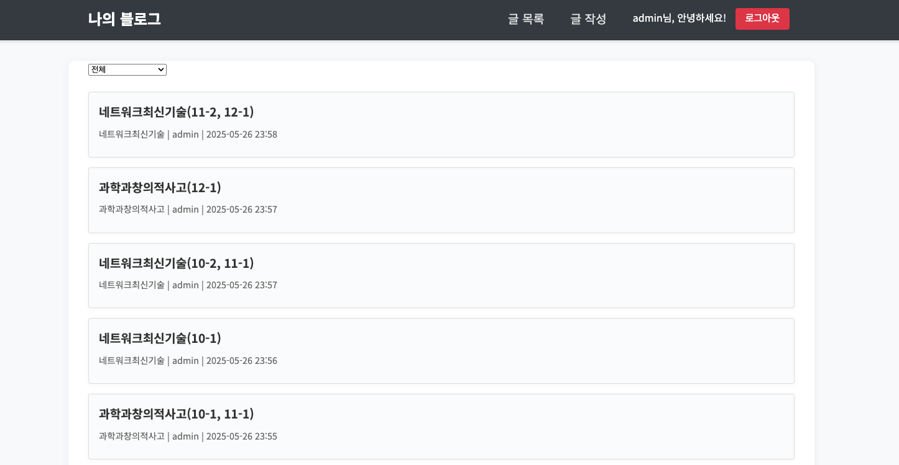
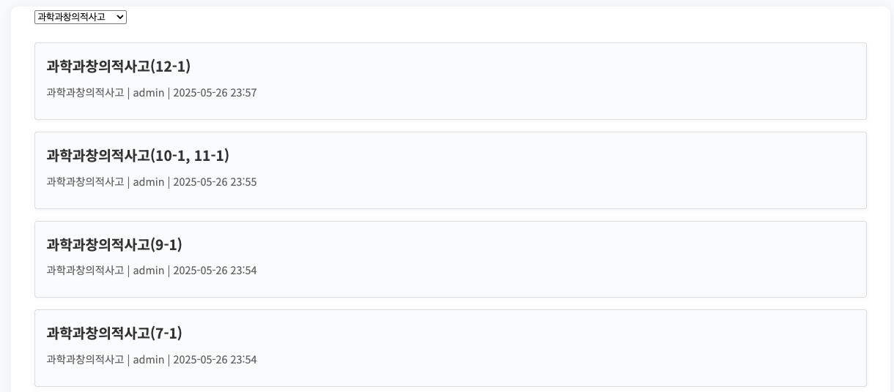
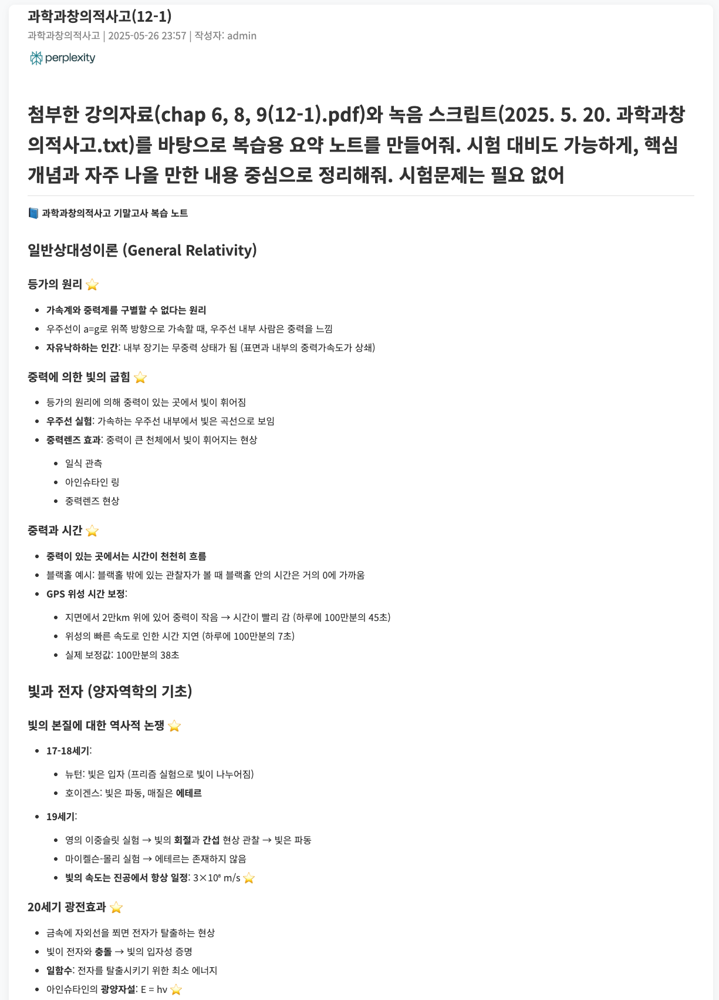
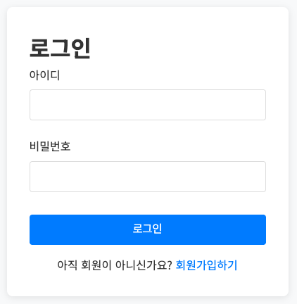
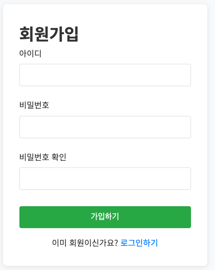
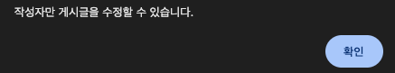
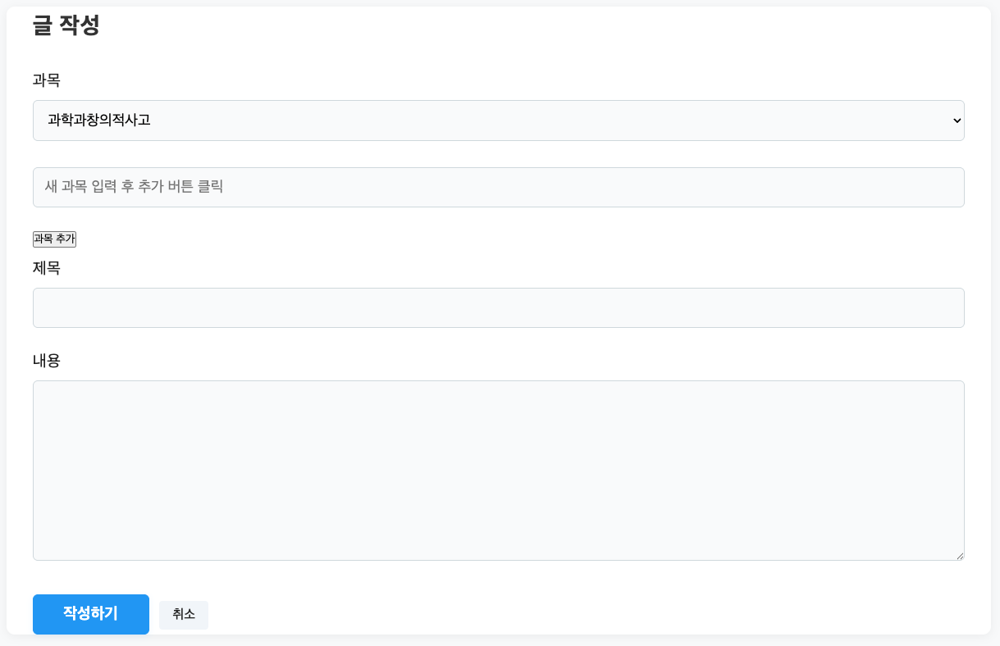
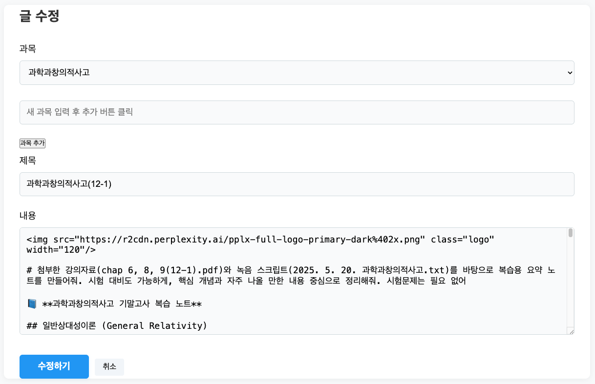

# 2025 1학기 정보통신과현대생활 기말과제(20223091 서동현)

**Spring Boot** 로 구현한 블로그에 퍼플렉시티로 9 ~ 12주차(기말고사 범위) 학습한 내용을 작성

## 1. 메인페이지

  

일반적인 블로그처럼 **게시글 목록**을 보여준다.  

  

또한 각 게시글마다 **과목(카테고리)를 설정**하게 해서, 메인페이지에서 **필터링**을 할 수 있다.  

## 2. 상세페이지

  

게시글을 누르면 위와 같이 상세페이지로 이동한다.  

ChatGPT, Claude, Gemini 등 여러 AI 는 출력을 **마크다운 문법**을 사용하기 때문에, 이에 맞춰서 **입력한 게시글도 마크다운 문법이 적용**되게끔 구현했다.  

## 3. 로그인/회원가입/로그아웃

  

  

위와 같이 **로그인 및 회원가입** 기능을 구현했다.  

  

  

위의 이미지처럼 **로그인을 하지 않으면**, **글 작성** 버튼이 **나오지 않게** 구현했다.  

  

  

또한 **글 작성자만 수정 및 삭제**를 할 수 있도록 구현했다.  

## 4. 글 작성/수정 폼

  

글 작성을 할 때 **과목, 제목, 내용**을 적어야 한다.  

그리고 **새 과목을 추가**할 수 있게끔 구현했다.  

  

또한 글 작성자가 글을 수정할 때 **과목, 제목, 내용** 등을 수정할 수 있게끔 구현했다.  